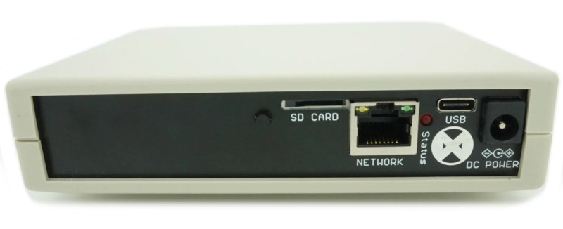
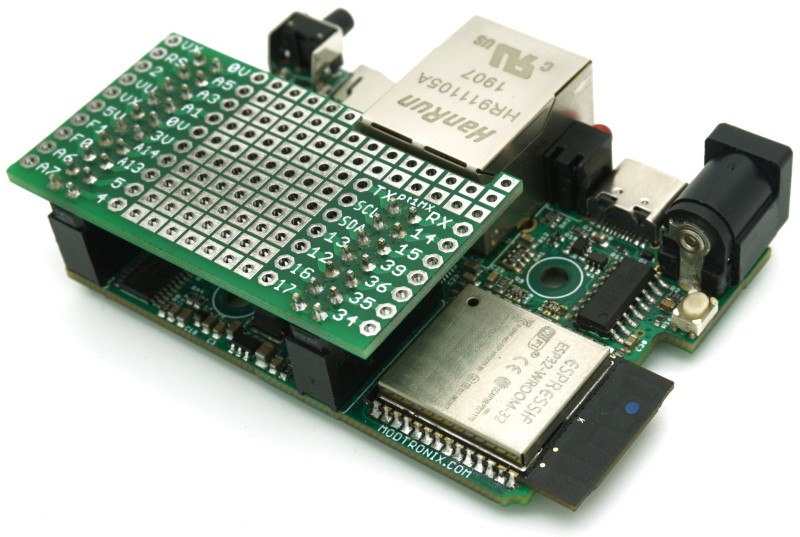
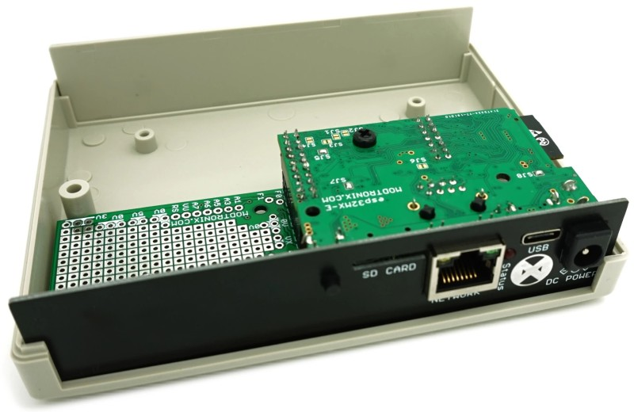
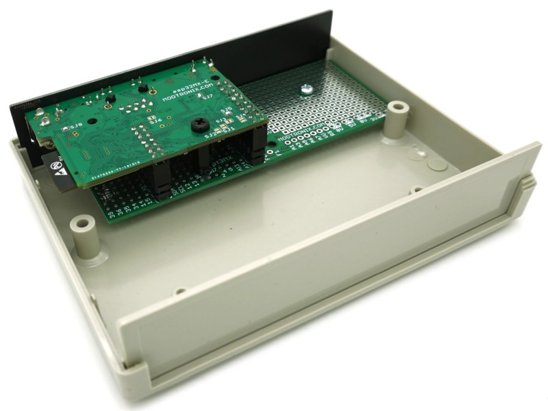

Documentation for the Modtronix esp32MX-E board.

The esp32MX-E is a versatile ESP32 based board with support for Ethernet, WiFi, Bluetooth, USB Type C, and more. It is designed with ease-of-integration in mind, so you can use it to simplify and accelerate the development of your own custom boards. 

# Schematics & Dimensions
The esp32MX-E schematics & dimensions are available in the "images" folder:
- [Schematics Page1](../images/esp32MX-E_schematics_pg1.png?raw=true)
- [Schematics Page2](../images/esp32MX-E_schematics_pg2.png?raw=true)
- [Dimensions](../images/esp32MX-E_dimensions.png?raw=true)

# Power
The esp32MX-E has an advanced power supply circuit that accommodates multiple inputs, provides 3.3 V and 5 V outputs, and delivers over 2 A of current to the user. It has high current switch mode regulators, at both 3.3 V and 5 V, to ensure low power consumption and high efficiency. Power can be supplied via the USB C connector, a 2.1 mm barrel connector, or the external power supply pin. This allows board designers to integrate the esp32MX-E as a daughterboard and get 3.3 V, 5 V, and supply voltage via the pin header connector.

# Reliability
Capacitors, in particular, are often the cause of failure in electronic devices. We have sourced the capacitors in esp32MX-E from reputable manufacturers like Panasonic, Samsung, Murata, TDK, and Yageo. Furthermore, all of our capacitor voltages are overrated by at least 190%.

# User I/O
esp32MX-E has a secondary 32-bit ARM processor (STM32F030F4) that serves by default as an I²C port expander. If required, you can program this secondary microcontroller with custom firmware.

# Features & Specifications

- **esp32 Module**
    - 32-bit LX6 microprocessor operating at 160 or 240 MHz
    - 4 MB Flash
    - 520 KB SRAM
- **Storage**: Micro SD card slot
- **Wi-Fi**: 802.11 b/g/n
- **Bluetooth**: v4.2 BR/EDR & BLE
- **USB**: Type C connector
    - Virtual COM port via USB
    - Programmable via USB
    - Power via USB
- **User I/O**:
    - 22 pins of which 4 are inputs only.
    - Four 5 V tolerant I/O pins
    - Not all I/Os are available when the SD Card is used
    - Programmable pull-up and pull-down resistors on most inputs
- **Secondary Processor**: I²C I/O expander implemented with a user programmable STM32F030F4
- **Expansion Pin Headers**: Two standard 2.54 mm (0.1") expansion pin headers
    - One with 14 pins (2x7)
    - One with 20 pins (2x10)
- **Power Supply**: Switch Mode
    - 5 V, over 2 A of current for user applications
    - 3.3 V, over 2 A of current for user applications
- **Power Sources**:
    - USB Type C connector
    - 2.1 mm barrel connector
    - Vx external power supply pin
- **Supply Voltage**: 4.5 V to 16 V (via 2.1 mm Barrel connector or Vx pin)
- **Operating Temperature**:
    - Standard version: 0° C to 85° C
    - Industrial version: -40° C to 85° C
- **Physical Controls**:
    - User LED
    - Button
- **Compact Size**: 64.4 mm x 42 mm (2.54" x 1.65")
- **Enclosure**: Optional

# Integration into Custom Hardware
Designed both for standalone use and for integration into larger projects, esp32MX-E has two female headers, so you can plug a small expansion board into it or use esp32MX-E itself as a daughterboard. All connectors, switches and LEDs are on one side of the board, which makes it far easier to design custom enclosures.

We supply raised male headers, for when esp32MX-E is used as a daughterboard, that provide 14.5 mm of space between it and the baseboard. A single board spacer and a screw are all you need for a secure fit, and we provide both a threaded and a non-threaded 14.5 mm spacer. Two additional screw holes are available, but are not required when using esp32MX-E as a daughterboard.

The Eagle Schematics and PCB files for all prototype boards and faceplates are available in [in the PCB folder](../pcb).

| | |
| --- | --- |
|  |  |
|  |  |

# Software Development
The two most popular ways to develop software for the esp32MX-E is using the official "Espressif ESP-IDF" or Arduino. The Arduino option is by far the easyest to get started. But, ESP-IDF provided many more options, and a true RTOS environment.

## Espressif ESP-IDF
For details to use the official ESP-IDF with the esp32MX-E, see [the "idf" examples folder](../examples/idf/README.md).

## Arduino
For details to use the official ESP-IDF with the esp32MX-E, see [the "idf" examples folder](../examples/arduino/README.md).

# STM32F030 Secondary Microcontroller
The esp32MX-E has a secondary STM32F030F4 microcontroller. It controls the PHY reset circuitry, and provides additional I/O via the the I2C port of the ESP32. It can also be programmed with custom firmware.

## Programming the STM32F030
The STM32F030F4 can be programmed via the following methods:
- Serial Port Bootloader
- ST-Link programmer
- By the host ESP32
See below for details.

### Serial Bootloader
The STM32 microcontroller has a built in serial(UART) bootloader, that is activated by pressing the user button while applying power to the esp32MX-E board. Once in the bootloader mode, we need a method to connect to the UART on the STM32. A simple way to do this is to have software on the ESP32 act as a bridge between the STM32 and virtual comm port chip. This enables us to use the STM32CubeProgrammer (STM32CubeProg) to program the STM32 via the UART. For this to work, the UART on the ESP32 has to be configured for 115200 baud, **even** parity, and 1 stop bit.

After programming the STM32 with the STM32CubeProgrammer, we can use this same setup to communicate with the UART on the STM32 via a serial port terminal. This is very useful for debugging. **Note** that the UART on the STM32 has to be configured for 115200 baud, **even** parity, and 1 stop bit. This is to match the settings required by the STM32CubeProgrammer, and which we used for our ESP32 bridge firmware.

### ST-Link Programmer
To program an STM32 chip using a ST-Link programmer, we need to connect the GND, Reset, SWDIO and SWCLK of the STM32 chip to the corresponding pins of the ST-Link programmer. These pins are all available available on the pin header of the esp32MX-E.

To get access to the UART on the STM32 during programming and debugging, we can use one of the following methods:
- Configure pins PA9 and PA3 of the STM32 as the UART TX and RX pins. These pins are available via the SCL(conected to PA9 of STM32) and PA3 pins on the pin header of the esp32MX-E board. When using the ST-Link V3, these pins can be connected to the RX and TX pins of the ST-Link programmer
- Configure pins PA9 and PA10 of the STM32 as the UART TX and RX pins. Then, program the ESP32 with firmware that acts as a bridge between the STM32 UART and USB virtual comm port chip. This will enable communicating with the STM32's UART via the USB virtual comm port.

### ESP32 programming the STM32
It is possible for the ESP32 to directly program the STM32 via it's UART bootloader. The ESP32 is connected to the STM32 via I2C. We have to add an I2C command to put the STM32 into bootloader mode. After doing this, the ESP32 will reconfigure the I2C pins connected to the STM32 to a UART. This is possible, seeing that the I2C and UART of the STM32F030 use the same pins. So, during normal operation, these pins on the STM32 are I2C pins, and when starting the STM32 in bootloader mode, they are UART pins.
