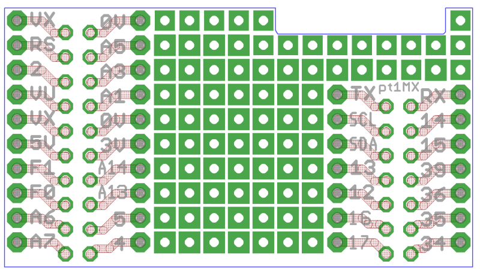
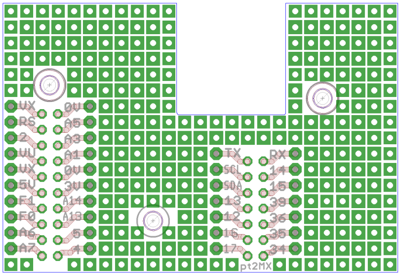
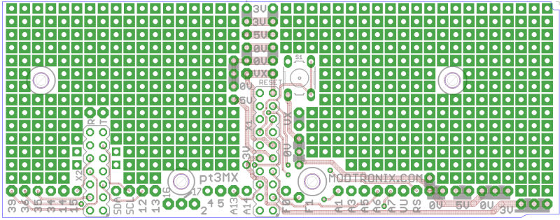
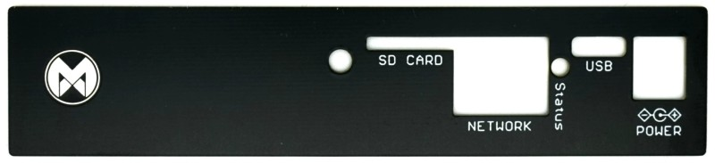

This folder contains Eagle PCB and Schematic files. They are all provided for fee, as is. We take no responsibility for any errors
or defects.

The folders contains the following.

# pt1mx
This folder contains a small prototype PCB that first onto the 2 female headers of the esp32MX-E board.

| | |
| --- | --- |
|  |  |

# pt2mx
This folder contains a larger prototype PCB that first onto the 2 female headers of the esp32MX-E board.

# pt3mx
This folder contains a baseboard for the esp32MX-E board. It is designed to be used with raised 2x7 and 2x10 male
pin headers(standard 0.1" = 2.54mm spacing). We use 14.5mm raised headers, and also have 14.5mm high PCB spacers
available. It fits into the Hammond RM2015S enclosure. The "fp_pt3mx" front panel can be used with the RM2015S
enclosure.

| | |
| --- | --- |
|  |  |

# fpan-mxe
This folder contains the frontpanel used when the esp32MX-E is used together with the pt3mx(or custom board) baseboard, and the RM2015S
enclosure. This frontpanel is a standard PCB (1 or 2 layers), with black solder mask. By default, we get them manufactured using HASL(Hot Air Solder Level) surface finish. For a bit extra, you can get it manufactured with the ENIG(Immersion Gold) surface finish, which adds a premium look.

| | |
| --- | --- |
|  |  |

